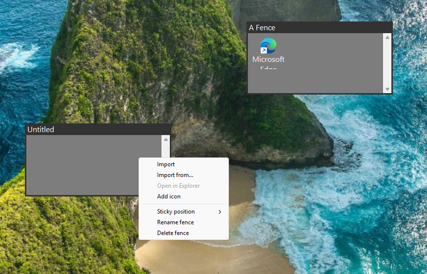

# Desktop Fences



Application to organize desktop shortcuts and files into resizable, movable containers ("fences") on the Windows desktop.

- Drag a fence by its title bar to move it; drag its edges or corners to resize it.
- Drop files or folders onto a fence to add shortcuts. Right-click inside to add, run, rename, or remove icons.
- Dropping a folder opens an import dialog to pick which items to include.
- Fence positions, sizes, and contents auto-save to `Documents/FencesConf/state.json` and restore on restart.
- Appearance (fonts, colours, borders, icon sizes) can be edited directly in `Documents/FencesConf/config.json`.

## Usage

System tray menu:

- **Add fence**: Creates a new empty fence at the centre of the screen.
- **Add fence from folder**: Opens a folder picker and populates a fence with its contents.
- **Reload**: Spawns a new instance and exits the current one.
- **Exit**: Closes the application and saves state.

Fence interaction:

- **Right-click a fence**: Rename, delete, add icons, open in Explorer, or set sticky position (snap to screen corner).
- **Drag title bar**: Move the fence.
- **Drag edges / corners**: Resize the fence.
- **Drag files / folders onto a fence**: Add shortcuts or import a folder.

## Build

```
cargo build --release
```

## License

MIT License.

AI-Disclosure: ai-generated.

